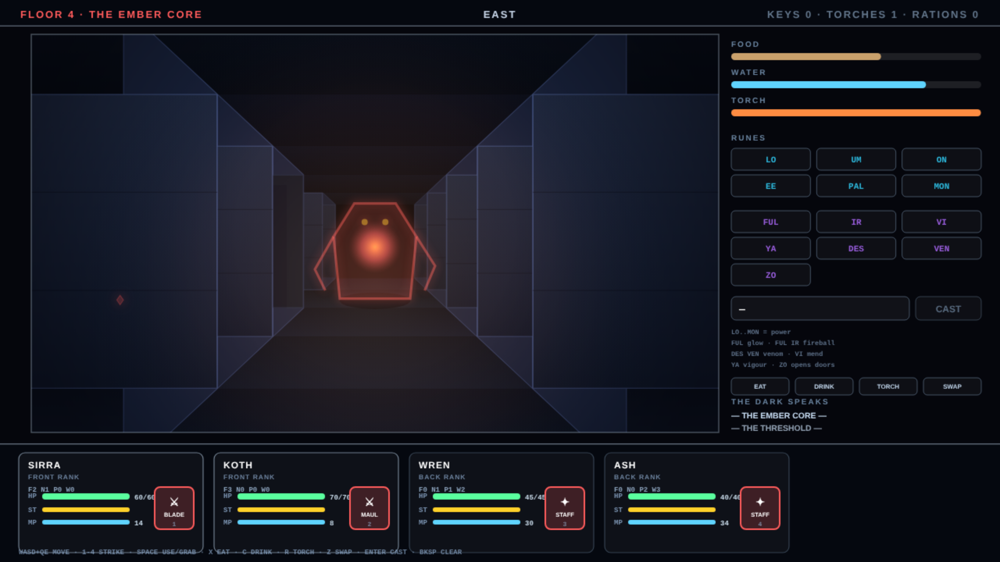

# NEON MASTER

Eighth game in the harsh-critic-loop series, after
[NEONOID](https://github.com/melvincarvalho/neonoid),
[NEON MINER](https://github.com/melvincarvalho/neonminer),
[NEODROID](https://github.com/melvincarvalho/neodroid),
[NEON DASH](https://github.com/melvincarvalho/neondash),
[NEONLINGS](https://github.com/melvincarvalho/neonlings),
[NEOPOLIS](https://github.com/melvincarvalho/neopolis) and
[NEON SCORCH](https://github.com/melvincarvalho/neonscorch). A Dungeon
Master tribute: four champions share one body of light in a first-person
grid dungeon. Skills grow only by use, magic is spelled rune by rune
(a power rune LO through MON, then the word — FUL for light, FUL IR for
fire, ZO to command doors), and between your party and the dark stands
one torch, one waterskin, and whatever the screamers drop. Original
floors and creatures — the real Dungeon Master (FTL Games, 1987) is
copyrighted, and revered here.

**Play it: <https://melvincarvalho.github.io/neonmaster/>**



**There are no assets.** Every pixel and every sound is generated from
code. Two files: `index.html`, `game.js`. WASD moves, Q/E turn, 1–4
strike, Space opens and grabs, X eats, C drinks at fountains, R lights a
fresh torch, Z swaps ranks. Tap runes in the sidebar and CAST. Four
floors down, the Ember Prism waits — carry it to the Core and feed it.

```bash
python3 -m http.server 8000   # or just open index.html
```

## The experiment

Same pipeline as the first seven games — one owner builds, deterministic
`?shot=` captures, four harsh sub-agent critics (three visual lenses plus
a Dungeon-Master-fidelity judge), consensus fixes, honest scores — and
the harness's next species of proof: **descents as theorems.**

The solution is not a keystroke recording: it is a list of **authored
objectives per floor** (take this torch, press that plate, hunt the
Warden) executed by a BFS-routing party bot with a survival policy that
eats, drinks, relights, rests before sieges, and fights whatever blocks
the way. Ablations delete policy branches, and `tools/playtest.sh`
proves 23 claims headlessly, every build:

- **the descent must be won twice**: at speedrun pace (t=68) and at
  3× traversal pace (t=188), where the survival economy has real
  teeth;
- **a party that does nothing must LOSE** — the dungeon's arithmetic
  (hunger, thirst, the dark) is itself lethal;
- **ablate-food LOSES** (starvation mid-descent), **ablate-drink LOSES**
  (dehydration crashes stamina — the parched cannot swing),
  **ablate-runes LOSES** (the leashing, regenerating Ember Warden
  defeats melee-only parties), and the compound **ablate-torch-runes
  LOSES** (blind melee misses 45%);
- **ablate-torch alone WINS — declared**: a rune-capable party can burn
  its way through the dark with fireballs; the torch is load-bearing
  for steel, not for sorcery;
- **15 mechanism proofs** isolate each dungeon law: hunger kills, the
  torch decays and relights, conjured glow, plain doors, iron keys,
  ZO's power tiers, fireballs, mend-the-most-wounded, XP-by-use skill
  advancement, screamer food drops, pit falls (floor transition plus
  damage), pressure plates, teleporters, fed-parties heal at rest, and
  darkness halves the sword arm (40/40 lit hits vs 27/40 dark).

## Scores

| round | composition | game-feel | HUD | visual mean | DM fidelity |
|---|---|---|---|---|---|
| 1 (final) | 3.4 | 2.4 | 4.3 | **3.4** | 5.5 |

Final-round verdicts: fidelity — *"the rune words are right, skills
advance by use, screamers are lunch… half the soul, rigorously proven.
The harness is the most honest thing in the repo."* Composition — *"a
tidy sci-fi HUD stapled to an unlit CAD wireframe."* Game-feel — *"until
the camera actually moves, nothing else it does will matter."* A
post-panel batch answered the sharpest cuts: the camera now glides,
bobs, and recoils (the feel critic's number-one fix); torchlight became
the art direction (warm breathing pool, hungry vignette, flicker);
monsters grew half again; the door/fountain/pit shots now face their
subjects; runes gained Enter-to-cast and Backspace-to-clear plus
clickable survival buttons; champion bars are labeled and numbered;
and the two harness oversells the fidelity critic caught were fixed —
the melee-only bot now gets its fair pre-siege rest (the theorem still
holds), and the dead hand-authored solution scaffolding was deleted.
The scores above are the panel's, judged before those fixes.

## Honest assessment

- **One critic round.** The first seven games looped to plateau; this
  one shipped after a single panel — the scores above are a floor, not
  a ceiling.
- **Four floors vs canon's fourteen**, six spells vs dozens, no
  resurrection altars, no sleeping, no item weight or hands inventory,
  no champion mirrors — the party is fixed.
- **Movement is instant grid snaps**, not the animated glide of the
  original's best remakes.
- Staged evidence shots are separate deterministic runs, not one
  continuous playthrough.

## Process notes

1. **The theorem found the sealed floor.** The first full-descent run
   stalled 900 seconds outside the final arena: floor 4's inner
   complex, as authored, had no reachable entrance at all — every
   corridor into it connected only to other sealed corridors. A BFS
   probe proved it, one opened tile fixed it. No human playtester was
   ever lost in it, because the machine was lost first.
2. **The dungeon was hydraulically impossible.** The first bot death
   was thirst: one fountain across four floors could not sustain any
   complete descent. The fix — a fountain per floor — was forced by
   telemetry, not taste.
3. **The war council bug**: taught to mend and rest before the boss,
   the starving party healed itself against hunger's drain in perfect
   equilibrium, forever. The council now recognizes a war of attrition
   it cannot win and presses on.
4. **Every survival ablation had to be engineered to matter.** At
   speedrun pace the party simply outran hunger, thirst, and darkness —
   so the ablations attack the human-pace run, the Warden leashes and
   regenerates (killing the kite exploit), and dehydration saps the
   sword arm. The theorems shaped the design as much as the design
   shaped the theorems.

## License

Copyright © 2026 Melvin Carvalho.

Licensed under the [GNU Affero General Public License v3.0 or later](LICENSE)
(AGPL-3.0-or-later).
